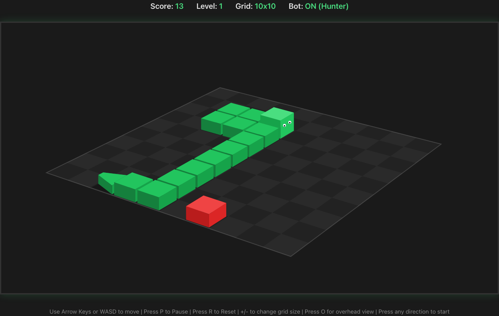

# Snake Game

A classic snake game reimagined with an isometric, rotating 3D board — built with TypeScript and HTML5 Canvas, bundled with Vite.

<p align="center">
  
</p>

## Features

- **Isometric 3D board** - the grid renders as a rotating isometric scene with shaded blocks, depth ordering, and adjustable perspective (no WebGL — just canvas 2D)
- **Overhead view** - toggle to a flat, top-down grid at any time with `O`
- **Board rotation** - spin the board manually with `Q`/`E`, tweak perspective with `[`/`]`, or let it auto-rotate during bot playback
- **Expanding grid** - the grid doubles in size when the snake fills 25% of the board, advancing the level and increasing speed
- **Iron Snake Mode** - an opt-in mode (toggle it on the start menu) that swaps the square grid for irregular, randomly-carved board shapes with interior holes to navigate around; each level sets a cumulative score goal, and clearing it morphs the board into a fresh shape while your snake stays in place
- **Adjustable starting grid** - use `+`/`-` keys to change grid resolution (5x5 to 50x50) before the game starts
- **Three game modes** - single player, two-player (PvP), and bot-vs-bot
- **11 autoplay bots** - each with a distinct strategy; pick one for solo bot demos or pit two against each other
- **Per-mode leaderboards** - separate top-10 boards for Single Player, Two Player, and Bot vs Bot, with score/length/survival-time stats, persisted in localStorage
- **High score** - persisted in localStorage across sessions (single player)
- **Redesigned start menu** - hero screen with a live rotating demo snake and expandable mode panels
- **Dark theme** with a green/red color scheme

## Game modes

- **New Game (single player)** - control one snake and chase the high score
- **Two Player (PvP)** - Player 1 (green, WASD) vs Player 2 (blue, arrow keys); last snake alive wins
- **Solo Bot** - watch a single bot of your choice play
- **Bot vs Bot** - pick two bots and watch them compete

Toggle **Iron Snake Mode** on the start menu to layer irregular, hole-filled boards and per-level score goals on top of your chosen mode.

## Bots

| Bot | Strategy |
|---|---|
| Survival | Maximizes open space and avoids dead ends before chasing food |
| Hunter | Pushes hard toward food while rejecting immediately fatal moves |
| Explorer | Roams open lanes and keeps distance from walls for a calmer style |
| Coiler | Hugs its own body to stay compact and methodical |
| Edge Runner | Patrols the perimeter, sweeping inward only to grab food |
| Ambusher | Lurks near the center and strikes when food spawns nearby |
| Chaser | Follows the shortest path to food, falling back to tail-chasing when unsafe |
| Nomad | Avoids its own trail to explore fresh territory |
| Spiral | Moves in clockwise spirals, turning inward at walls |
| Zigzag | Weaves in a sawtooth pattern while advancing toward food |
| Sweeper | Covers the grid in a back-and-forth lawnmower pattern |

## Controls

| Key | Action |
|---|---|
| Arrow keys / WASD | Move the snake (P1: WASD, P2: arrow keys in two-player) |
| P | Pause / Resume |
| R | Reset current run |
| Enter | Start a new game (menu / game over) |
| Esc | Return to the main menu |
| O | Toggle overhead (top-down) view |
| Q / E | Rotate the board clockwise / counter-clockwise |
| T | Pause / resume auto-rotation (during bot playback) |
| [ / ] | Decrease / increase perspective strength |
| +/- | Adjust grid size (before game starts, single player) |

In single player, the game begins when you press a direction key after starting a new game.

## Coming soon
- Color blind mode
- Global/online leaderboards to view other players' high scores
- First-person view from the snake
- Possible rename to "snek"

## Getting Started

```bash
npm install
npm run dev
```

Then open `http://localhost:5173` in your browser.

## Build

```bash
npm run build
npm run preview
```

## Testing

End-to-end tests run with [Playwright](https://playwright.dev/):

```bash
npm test            # run the E2E suite headless
npm run test:ui     # open the interactive Playwright runner
npm run test:report # open the last HTML report
```

## Tech Stack

- TypeScript
- Vite
- HTML5 Canvas
- Playwright (end-to-end tests)

## Project memory

This repo's development history is documented with **Jolli Memory** — each commit
is distilled into a structured summary you can browse as a knowledge wiki and an
interactive graph. See the [Jolli Memory viewing guide](docs/jolli-memory/README-JOLLI-MEMORY.md)
to set it up and explore it.
